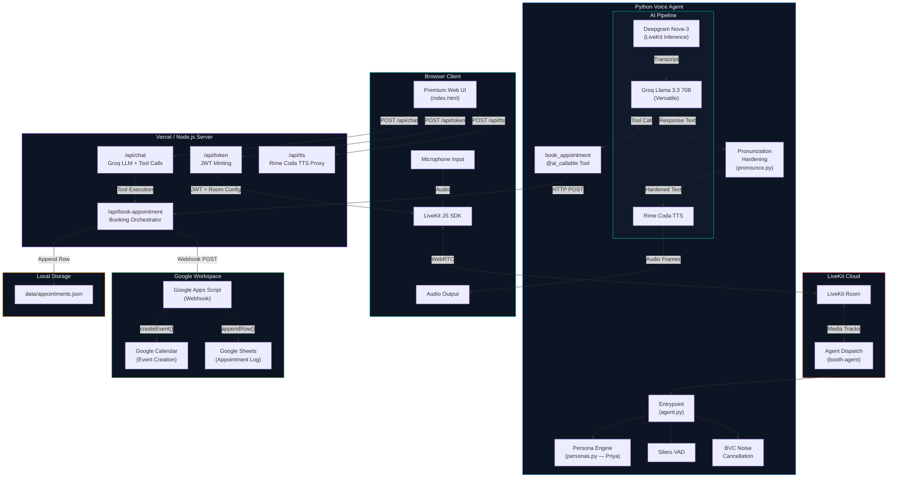
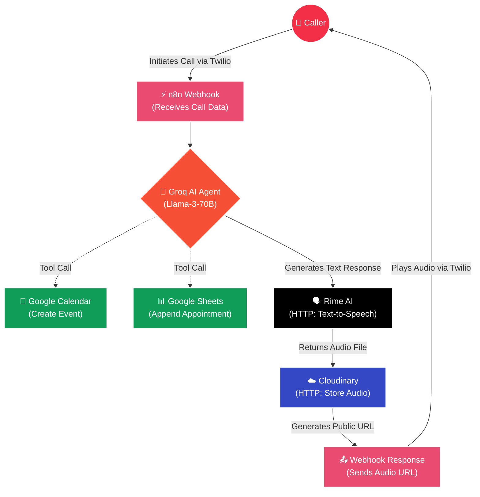
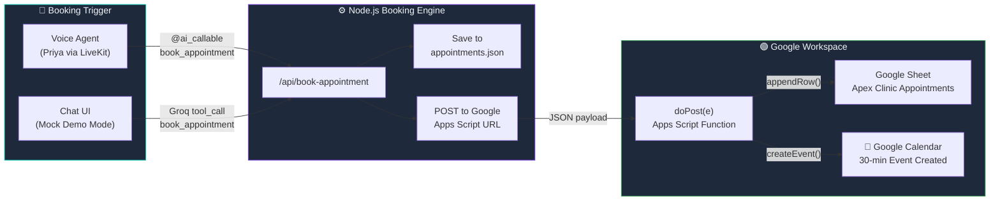
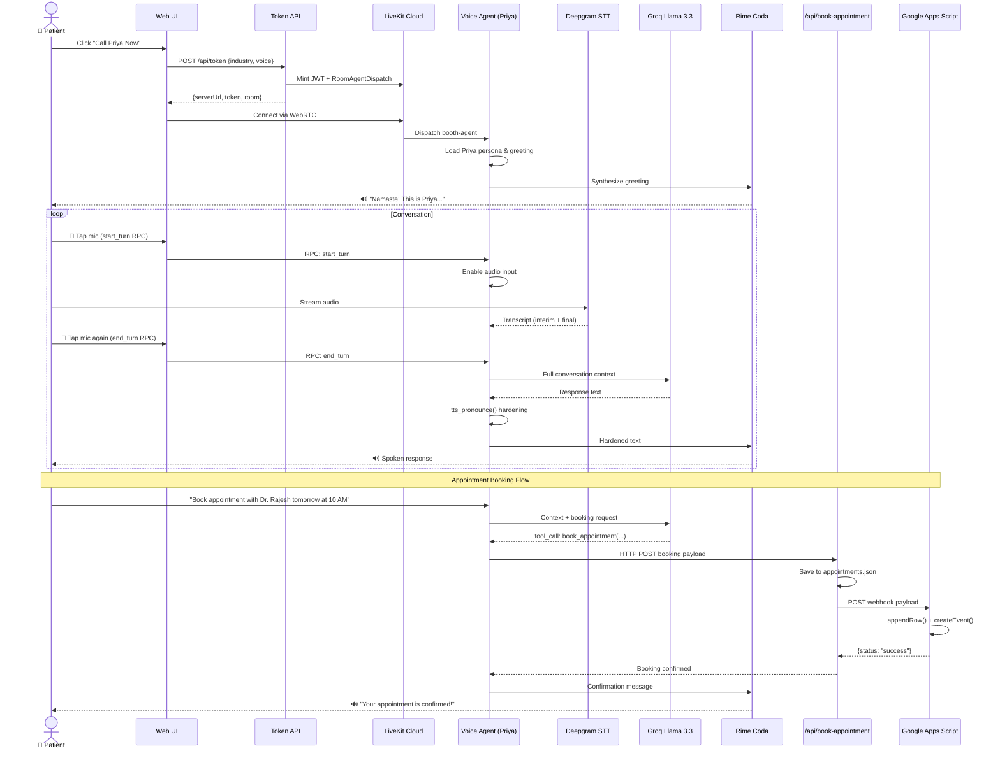
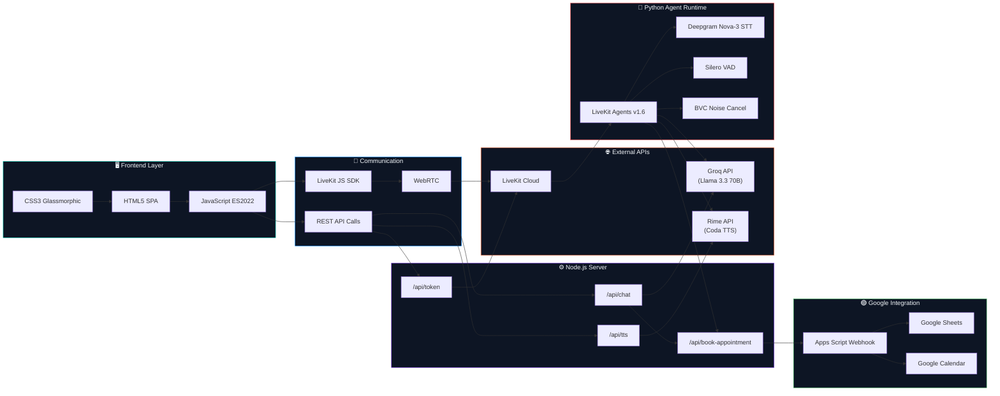
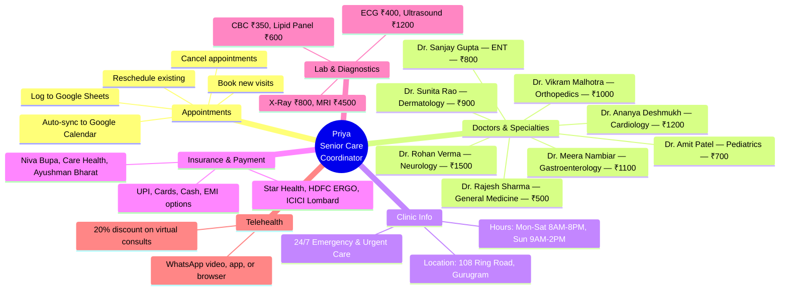
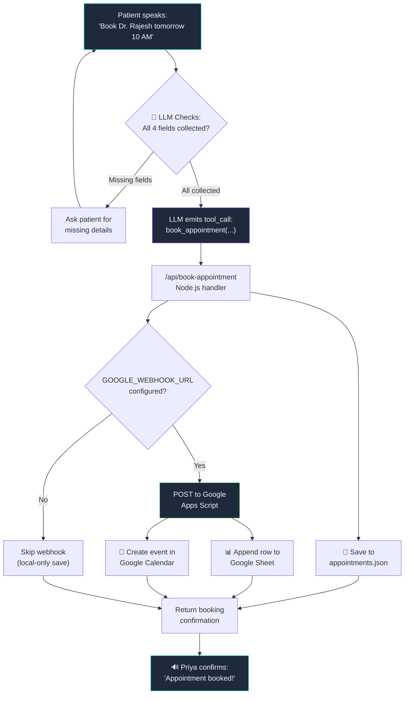
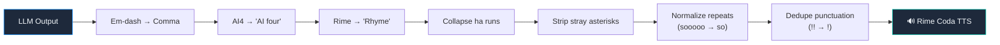

<p align="center">
  
  
  
  
  
  
</p>

<h1 align="center">
 

  <br />
         https://booking-voice-ochre.vercel.app/   <br />
           <br />
  Apex Healthcare Clinic — AI Voice Booking Agent
  <br />
  <sub>Real-time conversational AI for healthcare appointment scheduling with Google Calendar & Sheets sync</sub>
</h1>

<p align="center">
  
  
  
  
  
</p>

---

A full-stack **AI voice agent** that powers appointment booking at Apex Healthcare Clinic (Gurugram, India). Visitors call **"Priya,"** the AI Senior Care Coordinator, via a premium dark-themed web UI. Under the hood, a LiveKit real-time pipeline connects **Deepgram STT → Groq Llama 3.3 LLM → Rime Coda TTS** with push-to-talk and preemptive speech generation. Bookings are **automatically synced to Google Calendar and Google Sheets** via a Google Apps Script webhook.

> **Demo Mode Built-In** — The app runs a fully functional mock demo when LiveKit credentials aren't configured, using the Web Speech API for voice I/O and the Groq Chat API for intelligent responses.

---


https://github.com/user-attachments/assets/acbdf94d-e796-46b2-8f7a-7f1bd4d84168

🔗 **[Watch the full demo on YouTube](https://www.youtube.com/watch?v=OV0wJUCw5n0)**
##  Features

| Feature | Details |
|:--------|:--------|
| 🎙️ **Push-to-Talk Voice** | RPC-driven mic control with LiveKit turn management — no echo or overlap |
| 🧠 **LLM Persona — "Priya"** | A warm, HIPAA-mindful Indian Care Coordinator who books appointments, quotes fees in ₹, and verifies insurance |
| 🔊 **Rime Coda TTS** | Ultra-realistic speech synthesis with per-voice `time_scale_factor` tuning |
| 📝 **Live Transcript** | Real-time chat bubbles with clean `display_text` (expressive tokens stripped) |
| ⚡ **Preemptive Generation** | LLM + TTS start on interim transcripts to cut response latency |
| 🔇 **Noise Cancellation** | LiveKit BVC noise cancellation for clean audio in any environment |
| 📅 **Google Calendar Sync** | Appointments auto-create Google Calendar events via Apps Script webhook |
| 📊 **Google Sheets Logging** | Every booking is logged in a structured Google Sheet with patient details |
| 🛠️ **LLM Function Calling** | Groq Llama 3.3 auto-invokes `book_appointment` tool when all details are collected |
| 💾 **Local JSON Backup** | All bookings persisted to `data/appointments.json` as failsafe |
| 🎨 **Premium UI** | Glassmorphic dark theme with Inter/Outfit typography, gradient CTAs, and micro-animations |
| 🔄 **Mock Demo Mode** | Full voice experience without any API keys via Web Speech API + Groq Chat fallback |

---

##  System Architecture


# n8n-workflow-starforge
<div align="center">
  
#  Conversational AI Voice Agent

*An intelligent, low-latency voice assistant built on **n8n** that handles phone calls, processes natural language, and books appointments autonomously.*

[](https://n8n.io/)
[](https://twilio.com/)
[](https://groq.com/)
[](https://rime.ai/)
[](https://cloudinary.com/)

---
</div>

##  Overview

This project implements a fully automated, conversational voice assistant using **n8n**. By connecting **Twilio** for telephony with **Groq's Llama-3-70B** model, the system can hold natural, real-time conversations over the phone. 

What makes this agent powerful is its ability to take action: during a call, it can intelligently trigger tools to **create Google Calendar events** and **append data to Google Sheets** (e.g., booking appointments). The agent's text responses are synthesized into lifelike speech using **Rime AI**, hosted instantly on **Cloudinary**, and played back to the caller seamlessly.

## 📸 Workflow Architecture

> **Note:** This is the visual representation of our n8n automation flow.

*(Delete this text and drag your image here)*

## ⚙️ The Tech Stack

- **[n8n](https://n8n.io/):** The core orchestration engine linking all APIs and services.
- **[Twilio](https://www.twilio.com/):** Receives incoming phone calls and sends the voice/text data to our webhook.
- **[Groq (Llama-3-70B)](https://groq.com/):** Serves as the brain of the agent. It processes the caller's intent, generates conversational text, and decides when to use external tools.
- **[Rime AI](https://rime.ai/):** Converts the LLM's text responses into ultra-realistic, low-latency audio.
- **[Cloudinary](https://cloudinary.com/):** Temporarily stores the generated audio files to generate a direct playback URL.
- **[Google Workspace](https://workspace.google.com/):** Used as memory and action endpoints for the AI to book calendar events and manage sheets.

##  System Flowchart

Here is the step-by-step execution path of our workflow:



---

##  Google Sheets & Calendar Integration

The appointment booking system connects to **Google Workspace** via a Google Apps Script webhook. When a patient books an appointment — via voice or chat — the data flows through a dual-write pipeline:



### Google Sheet Schema

| Column | Field | Example |
|:-------|:------|:--------|
| A | `Timestamp` | `2026-08-10 11:08:01` |
| B | `Patient Name` | `Rahul Sharma` |
| C | `Phone Number` | `+91 9876543210` |
| D | `Doctor / Specialty` | `Dr. Rajesh Sharma (General Medicine)` |
| E | `Appointment Date & Time` | `Tomorrow at 10 AM` |
| F | `Insurance / Payment` | `Star Health Insurance` |
| G | `Status` | `Confirmed` |
| H | `Notes` | `Routine Health Checkup` |

### Google Calendar Event

Each confirmed booking creates a **30-minute calendar event** with the title format:  
`Medical Appointment: <Patient Name> (<Doctor/Specialty>)`

The event description includes all collected patient details.

>  **Full Setup Guide** → See [`GOOGLE_INTEGRATION.md`](GOOGLE_INTEGRATION.md) for step-by-step setup instructions.

---

##  Call Flow Sequence



---

## 🛠️ Tech Stack

### Frontend
| Technology | Purpose | Version |
|:-----------|:--------|:--------|
|  | Single-page application shell | — |
|  | Glassmorphic dark theme, animations | — |
|  | LiveKit client, voice controls, mock mode | ES2022 |
|  | WebRTC real-time communication | v2.x CDN |
|  | Browser speech recognition (mock mode fallback) | Native |

### Backend — Node.js API Server
| Technology | Purpose | Version |
|:-----------|:--------|:--------|
|  | HTTP server, static file serving, env loading | 18+ |
|  | JWT minting, room configuration, agent dispatch | ^2.9.0 |
|  | LLM chat endpoint with function calling (`/api/chat`) | — |
|  | TTS proxy endpoint (`/api/tts`) | — |
|  | Webhook integration for Sheets + Calendar sync | — |
|  | Serverless deployment (functions at `/api/*`) | — |

### Backend — Python Voice Agent
| Technology | Purpose | Version |
|:-----------|:--------|:--------|
|  | Agent runtime | 3.10 – 3.14 |
|  | Agent framework, session management, RPC | ~1.6 |
|  | Speech-to-Text (via LiveKit Inference, keyless) | — |
|  | LLM inference (Llama 3.3 70B Versatile) | — |
|  | Text-to-Speech with per-voice speed tuning | — |
|  | Voice Activity Detection | — |
|  | Background Voice Cancellation / Noise cancellation | ~0.2 |
|  | Fast Python package manager | Latest |
|  | Containerized agent deployment | Multi-stage |

### Integrations
| Technology | Purpose | Connection |
|:-----------|:--------|:-----------|
|  | Appointment log database | Apps Script `appendRow()` |
|  | Calendar event creation | Apps Script `createEvent()` |
|  | Serverless webhook glue | `doPost(e)` web app endpoint |

---

## 🔗 Tech Stack Connection Map



---

##  Project Structure

```
apex-healthcare-voice-agent/
│
├── 📄 README.md                   ← You are here
├── 📄 GOOGLE_INTEGRATION.md       ← Step-by-step Google Sheets & Calendar setup
├── 📄 package.json                ← Node.js manifest (livekit-server-sdk)
├── 📄 server.js                   ← Local dev server (static + /api/* proxy)
├── 📄 vercel.json                 ← Vercel deployment config
├── 📄 .env.example                ← Frontend env template
├── 📄 .gitignore
├── 📄 .vercelignore
│
├── 📂 public/                     ← Static frontend (served by Vercel / Node)
│   └── 📄 index.html              ← Full SPA: hero, doctors grid, call modal (46KB)
│
├── 📂 api/                        ← Vercel serverless functions
│   ├── 📄 token.js                ← POST /api/token — JWT minting + agent dispatch
│   ├── 📄 chat.js                 ← POST /api/chat — Groq LLM with book_appointment tool
│   ├── 📄 tts.js                  ← POST /api/tts — Rime Coda TTS audio proxy
│   ├── 📄 book-appointment.js     ← POST /api/book-appointment — Booking orchestrator
│   └── 📄 booking.js              ← Core booking logic: local save + Google webhook dispatch
│
├── 📂 data/                       ← Local appointment storage
│   └── 📄 appointments.json       ← JSON backup of all bookings (failsafe)
│
└── 📂 agent/                      ← LiveKit voice agent (Python)
    ├── 📄 agent.py                ← Entrypoint: BoothAgent class, RPC handlers, book_appointment tool
    ├── 📄 personas.py             ← "Priya" persona, clinic details, voice config, system prompt
    ├── 📄 pronounce.py            ← TTS pronunciation hardening (Rime→Rhyme, em-dash, etc.)
    ├── 📄 pyproject.toml          ← Python dependencies (livekit-agents + plugins)
    ├── 📄 Dockerfile              ← Multi-stage production container
    ├── 📄 livekit.toml            ← LiveKit agent configuration
    ├── 📄 .env.example            ← Agent env template (LiveKit + Groq + Rime keys)
    └── 📄 README.md               ← Agent-specific documentation
```

---

##  Quick Start

### Prerequisites

| Tool | Install |
|:-----|:--------|
| **Node.js** 18+ | [nodejs.org](https://nodejs.org) |
| **Python** 3.10+ | [python.org](https://python.org) |
| **uv** (Python pkg mgr) | `pip install uv` |
| **LiveKit Cloud Account** | [cloud.livekit.io](https://cloud.livekit.io) |

### 1️⃣ Clone & Install

```bash
git clone https://github.com/MaanasVerma25/Booking-voice.git
cd Booking-voice
npm install
```

### 2️⃣ Configure Environment

```bash
# Frontend / Token Server
cp .env.example .env
# Fill in:
#   LIVEKIT_URL=wss://your-project.livekit.cloud
#   LIVEKIT_API_KEY=...
#   LIVEKIT_API_SECRET=...
#   GOOGLE_WEBHOOK_URL=https://script.google.com/macros/s/YOUR_SCRIPT_ID/exec

# Voice Agent
cd agent
cp .env.example .env
# Fill in:
#   LIVEKIT_URL, LIVEKIT_API_KEY, LIVEKIT_API_SECRET
#   GROQ_API_KEY=...
#   RIME_API_KEY=...
#   GOOGLE_WEBHOOK_URL=... (same webhook URL)
```

### 3️⃣ Set Up Google Integration (Optional but Recommended)

Follow the step-by-step guide in [`GOOGLE_INTEGRATION.md`](GOOGLE_INTEGRATION.md) to:
1. Create a Google Sheet with the appointment schema
2. Add the Apps Script webhook handler
3. Deploy as a web app
4. Add the webhook URL to your `.env`

### 4️⃣ Start the Voice Agent

```bash
cd agent
uv sync
uv run agent.py dev
```

### 5️⃣ Start the Frontend

```bash
# From project root
npm run dev
# → http://localhost:3000
```

> ** No API keys?** The app automatically falls into **Mock Demo Mode** — Priya responds with intelligent replies using the Groq Chat API and the browser's built-in speech synthesis. Perfect for UI development and demos.

---

##  Agent Intelligence

### Persona System

The agent embodies **Priya**, a Senior Care Coordinator at Apex Healthcare Clinic (Gurugram, India) with knowledge of:



### LLM Function Calling — Appointment Booking Tool

The Groq Llama 3.3 LLM is equipped with a `book_appointment` function tool. When the patient provides all required details (name, phone, doctor, date/time), the LLM **automatically invokes** the tool:



### Required Booking Fields

| # | Field | Example | Collection Method |
|:--|:------|:--------|:-----------------|
| 1 | Patient's Full Name | `Rahul Sharma` | Asked by Priya |
| 2 | Mobile / Phone Number | `+91 9876543210` | Asked by Priya |
| 3 | Doctor / Specialty | `Dr. Rajesh Sharma` | Selected or spoken |
| 4 | Preferred Date & Time | `Tomorrow at 10 AM` | Requested by patient |

### Pronunciation Hardening Pipeline

All LLM output passes through `tts_pronounce()` before reaching the TTS engine:



---

##  API Endpoints

| Endpoint | Method | Description |
|:---------|:-------|:------------|
| `/api/token` | POST | Mints LiveKit JWT, configures room, dispatches `booth-agent` |
| `/api/chat` | POST | Groq Llama 3.3 chat with `book_appointment` function tool |
| `/api/tts` | POST/GET | Proxies text to Rime Coda TTS, returns MP3 audio |
| `/api/book-appointment` | POST | Saves booking locally + dispatches to Google webhook |

### `/api/chat` — Groq LLM with Function Calling

```json
// Request
POST /api/chat
{
  "message": "Book appointment with Dr. Rajesh tomorrow at 10 AM",
  "history": [
    { "role": "user", "content": "Hi Priya" },
    { "role": "assistant", "content": "Namaste! How can I help?" }
  ]
}

// Response (when tool is invoked)
{
  "reply": "Your appointment with Dr. Rajesh Sharma is confirmed for tomorrow at ten AM!",
  "booking": {
    "success": true,
    "booking": { "id": "APT-1786338481542", ... },
    "googleSynced": true
  },
  "model": "llama-3.3-70b-versatile"
}
```

---

## 🚢 Deployment

### Frontend → Vercel

```bash
# Install Vercel CLI
npm i -g vercel

# Deploy to production
vercel --prod
```

> ⚠️ Turn **Deployment Protection off** if the app needs public access without authentication.

### Voice Agent → LiveKit Cloud

```bash
cd agent

# First time: create the agent
lk agent create --region us-east --secrets-file .env

# Subsequent updates
lk agent deploy
```

### Voice Agent → Docker (Self-hosted)

```bash
cd agent
docker build -t apex-voice-agent .
docker run --env-file .env apex-voice-agent
```

---

##  Environment Variables

### Frontend (`/.env`)

| Variable | Required | Description |
|:---------|:---------|:------------|
| `LIVEKIT_URL` | ✅ | LiveKit Cloud WebSocket URL |
| `LIVEKIT_API_KEY` | ✅ | LiveKit API key |
| `LIVEKIT_API_SECRET` | ✅ | LiveKit API secret |
| `GOOGLE_WEBHOOK_URL` | ⭐ | Google Apps Script webhook URL for Calendar + Sheets |
| `PORT` | ❌ | Dev server port (default: `3000`) |

### Agent (`/agent/.env`)

| Variable | Required | Description |
|:---------|:---------|:------------|
| `LIVEKIT_URL` | ✅ | LiveKit Cloud WebSocket URL |
| `LIVEKIT_API_KEY` | ✅ | LiveKit API key |
| `LIVEKIT_API_SECRET` | ✅ | LiveKit API secret |
| `GROQ_API_KEY` | ✅ | Groq API key for Llama 3.3 70B |
| `RIME_API_KEY` | ✅ | Rime API key for Coda TTS |
| `GOOGLE_WEBHOOK_URL` | ⭐ | Google Apps Script webhook URL (same as frontend) |

> 🔒 All `.env` files are gitignored. Share credentials via a password manager only.  
> ⭐ `GOOGLE_WEBHOOK_URL` is optional but recommended — without it, bookings are saved locally to `data/appointments.json` only.

---

##  Design System

The frontend uses a carefully crafted dark theme optimized for healthcare:

```
Color Palette
─────────────────────────────────
Background     #090E17  ██████  Deep Navy
Card BG        #111A2A  ██████  Frosted Glass
Primary        #00D2B8  ██████  Medical Teal
Accent Blue    #0088FF  ██████  Trust Blue
Google Green   #34A853  ██████  Integration Green
Text Main      #F1F5F9  ██████  Clean White
Text Muted     #94A3B8  ██████  Soft Gray
Danger         #FF4D4D  ██████  Alert Red
Success        #10B981  ██████  Health Green
─────────────────────────────────
Typography: Inter (body) + Outfit (headings)
```

---

##  Testing

### Test Appointment Booking via cURL / PowerShell

```powershell
Invoke-RestMethod -Uri "http://localhost:3000/api/book-appointment" `
  -Method Post `
  -ContentType "application/json" `
  -Body '{"patient_name": "Rohan Verma", "phone_number": "+91 9876543210", "doctor_or_specialty": "Dr. Rajesh Sharma (General Medicine)", "date_time": "Tomorrow at 10 AM", "insurance_details": "Star Health Insurance", "notes": "Fever and routine health checkup"}'
```

### Test via Voice Assistant

Speak to Priya:
> *"Hi Priya, I want to book an appointment with Dr. Rajesh Sharma tomorrow at 10 AM. My name is Rohan Verma and my phone number is 9876543210."*

Priya will automatically invoke `book_appointment` and save the event to Google Calendar and Google Sheets!

### Test via Chat (Mock Mode)

In mock demo mode, type the same booking request in the chat interface. The Groq LLM will invoke the `book_appointment` tool call and confirm the booking.

---

##  Contributing

1. Fork the repository
2. Create a feature branch (`git checkout -b feature/amazing-feature`)
3. Commit your changes (`git commit -m 'Add amazing feature'`)
4. Push to the branch (`git push origin feature/amazing-feature`)
5. Open a Pull Request

---

<p align="center">
  <sub>Built by Maanas,Kartikeya,Yogita and Varuni using Rime Coda TTS, Groq, Qdrant, Google Sheets & Google Calendar</sub>
  <br />
  <sub>© 2026 Apex Healthcare Clinic Voice AI</sub>
</p>
