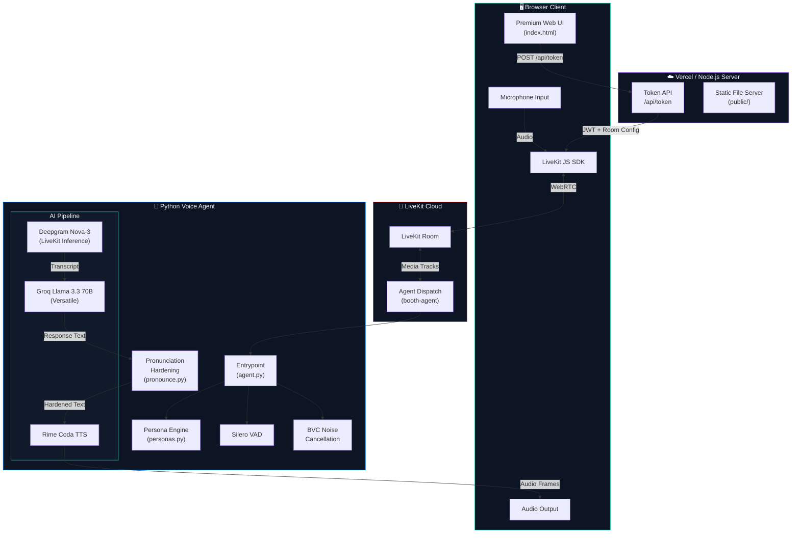
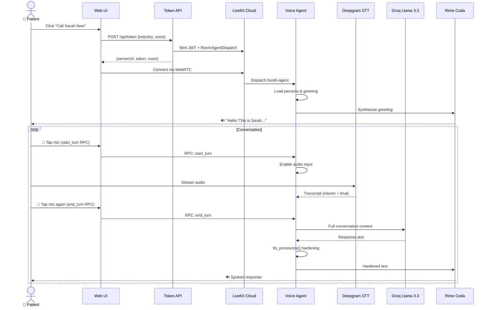
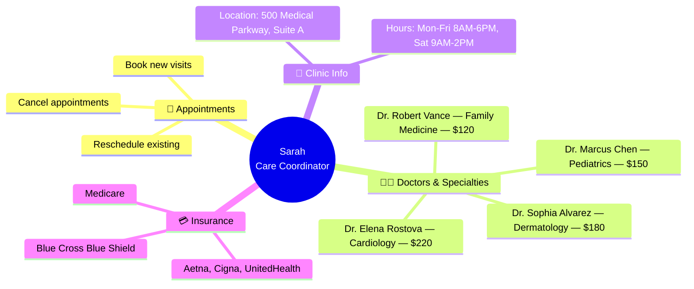
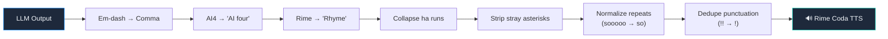

<p align="center">
  
  
  
  
  
</p>

<h1 align="center">
  <br />
  🏥 Apex Medical Center — AI Voice Booking Agent
  <br />
  <sub>Real-time conversational AI for healthcare appointment scheduling</sub>
</h1>

<p align="center">
  
  
  
  
</p>

---

A full-stack **AI voice agent** that powers appointment booking at Apex Medical Center. Visitors call "Sarah," the AI Care Coordinator, via a premium dark-themed web UI. Under the hood, a LiveKit real-time pipeline connects **Deepgram STT → Groq Llama 3.3 LLM → Rime Coda TTS** with push-to-talk and preemptive speech generation for a latency-optimized conversational experience.

> **Demo Mode Built-In** — The app runs a fully functional mock demo when LiveKit credentials aren't configured, using the Web Speech API for voice I/O.

---

## ✨ Features

| Feature | Details |
|:--------|:--------|
| 🎙️ **Push-to-Talk Voice** | RPC-driven mic control with LiveKit turn management — no echo or overlap |
| 🧠 **LLM Persona** | "Sarah" — a warm, HIPAA-mindful care coordinator who books appointments, quotes fees, and verifies insurance |
| 🔊 **Rime Coda TTS** | Ultra-realistic speech synthesis with per-voice `time_scale_factor` tuning |
| 📝 **Live Transcript** | Real-time chat bubbles with clean `display_text` (expressive tokens stripped) |
| ⚡ **Preemptive Generation** | LLM + TTS start on interim transcripts to cut response latency |
| 🔇 **Noise Cancellation** | LiveKit BVC noise cancellation for clean audio in any environment |
| 🎨 **Premium UI** | Glassmorphic dark theme with Inter/Outfit typography, gradient CTAs, and micro-animations |
| 🔄 **Mock Demo Mode** | Full voice experience without any API keys via Web Speech API fallback |

---

## 🏗️ System Architecture



---

## 🔄 Call Flow Sequence



---

## 🛠️ Tech Stack

### Frontend
| Technology | Purpose | Version |
|:-----------|:--------|:--------|
|  | Single-page application shell | — |
|  | Glassmorphic dark theme, animations | — |
|  | LiveKit client, voice controls, mock mode | ES2022 |
|  | WebRTC real-time communication | v2.x CDN |
|  | Browser speech recognition (mock mode fallback) | Native |

### Backend — Token Server
| Technology | Purpose | Version |
|:-----------|:--------|:--------|
|  | HTTP server, static file serving, env loading | 18+ |
|  | JWT minting, room configuration, agent dispatch | ^2.9.0 |
|  | Serverless deployment (token function at `/api/token`) | — |

### Backend — Voice Agent
| Technology | Purpose | Version |
|:-----------|:--------|:--------|
|  | Agent runtime | 3.10 – 3.14 |
|  | Agent framework, session management, RPC | ~1.6 |
|  | Speech-to-Text (via LiveKit Inference, keyless) | — |
|  | LLM inference (Llama 3.3 70B Versatile) | — |
|  | Text-to-Speech with per-voice speed tuning | — |
|  | Voice Activity Detection | — |
|  | Background Voice Cancellation / Noise cancellation | ~0.2 |
|  | Fast Python package manager | Latest |
|  | Containerized agent deployment | Multi-stage |

---

## 📁 Project Structure

```
apex-medical-voice-agent/
│
├── 📄 README.md                   ← You are here
├── 📄 package.json                ← Node.js manifest (livekit-server-sdk)
├── 📄 server.js                   ← Local dev server (static + /api/token proxy)
├── 📄 vercel.json                 ← Vercel deployment config
├── 📄 .env.example                ← Frontend env template
├── 📄 .gitignore
├── 📄 .vercelignore
│
├── 📂 public/                     ← Static frontend (served by Vercel / Node)
│   └── 📄 index.html              ← Full SPA: hero, doctors grid, call modal (31KB)
│
├── 📂 api/                        ← Vercel serverless functions
│   └── 📄 token.js                ← POST /api/token — JWT minting + agent dispatch
│
└── 📂 agent/                      ← LiveKit voice agent (Python)
    ├── 📄 agent.py                ← Entrypoint: BoothAgent class, RPC handlers, session setup
    ├── 📄 personas.py             ← "Sarah" persona, clinic details, voice config, system prompt
    ├── 📄 pronounce.py            ← TTS pronunciation hardening (Rime→Rhyme, em-dash, etc.)
    ├── 📄 pyproject.toml          ← Python dependencies (livekit-agents + plugins)
    ├── 📄 Dockerfile              ← Multi-stage production container
    ├── 📄 livekit.toml            ← LiveKit agent configuration
    ├── 📄 .env.example            ← Agent env template (LiveKit + Groq + Rime keys)
    └── 📄 README.md               ← Agent-specific documentation
```

---

## 🚀 Quick Start

### Prerequisites

| Tool | Install |
|:-----|:--------|
| **Node.js** 18+ | [nodejs.org](https://nodejs.org) |
| **Python** 3.10+ | [python.org](https://python.org) |
| **uv** (Python pkg mgr) | `pip install uv` |
| **LiveKit Cloud Account** | [cloud.livekit.io](https://cloud.livekit.io) |

### 1️⃣ Clone & Install

```bash
git clone https://github.com/MaanasVerma25/Booking-voice.git
cd Booking-voice
npm install
```

### 2️⃣ Configure Environment

```bash
# Frontend / Token Server
cp .env.example .env
# Fill in:
#   LIVEKIT_URL=wss://your-project.livekit.cloud
#   LIVEKIT_API_KEY=...
#   LIVEKIT_API_SECRET=...

# Voice Agent
cd agent
cp .env.example .env
# Fill in:
#   LIVEKIT_URL, LIVEKIT_API_KEY, LIVEKIT_API_SECRET
#   ANTHROPIC_API_KEY=...
#   RIME_API_KEY=...
```

### 3️⃣ Start the Voice Agent

```bash
cd agent
uv sync
uv run agent.py dev
```

### 4️⃣ Start the Frontend

```bash
# From project root
npm run dev
# → http://localhost:3000
```

> **💡 No API keys?** The app automatically falls into **Mock Demo Mode** — Sarah responds with scripted replies using the browser's built-in speech synthesis. Perfect for UI development and demos.

---

## 🧠 Agent Intelligence

### Persona System

The agent embodies **Sarah**, a Care Coordinator at Apex Medical Center with knowledge of:



### Pronunciation Hardening Pipeline

All LLM output passes through `tts_pronounce()` before reaching the TTS engine:



---

## 🚢 Deployment

### Frontend → Vercel

```bash
# Install Vercel CLI
npm i -g vercel

# Deploy to production
vercel --prod
```

> ⚠️ Turn **Deployment Protection off** if the app needs public access without authentication.

### Voice Agent → LiveKit Cloud

```bash
cd agent

# First time: create the agent
lk agent create --region us-east --secrets-file .env

# Subsequent updates
lk agent deploy
```

### Voice Agent → Docker (Self-hosted)

```bash
cd agent
docker build -t apex-voice-agent .
docker run --env-file .env apex-voice-agent
```

---

## 🔐 Environment Variables

### Frontend (`/.env`)

| Variable | Required | Description |
|:---------|:---------|:------------|
| `LIVEKIT_URL` | ✅ | LiveKit Cloud WebSocket URL |
| `LIVEKIT_API_KEY` | ✅ | LiveKit API key |
| `LIVEKIT_API_SECRET` | ✅ | LiveKit API secret |
| `PORT` | ❌ | Dev server port (default: `3000`) |

### Agent (`/agent/.env`)

| Variable | Required | Description |
|:---------|:---------|:------------|
| `LIVEKIT_URL` | ✅ | LiveKit Cloud WebSocket URL |
| `LIVEKIT_API_KEY` | ✅ | LiveKit API key |
| `LIVEKIT_API_SECRET` | ✅ | LiveKit API secret |
| `ANTHROPIC_API_KEY` | ✅ | Anthropic API key for Claude |
| `RIME_API_KEY` | ✅ | Rime API key for Coda TTS |

> 🔒 All `.env` files are gitignored. Share credentials via a password manager only.

---

## 🎨 Design System

The frontend uses a carefully crafted dark theme optimized for healthcare:

```
Color Palette
─────────────────────────────────
Background     #090E17  ██████  Deep Navy
Card BG        #111A2A  ██████  Frosted Glass
Primary        #00D2B8  ██████  Medical Teal
Accent Blue    #0088FF  ██████  Trust Blue
Text Main      #F1F5F9  ██████  Clean White
Text Muted     #94A3B8  ██████  Soft Gray
Danger         #FF4D4D  ██████  Alert Red
Success        #10B981  ██████  Health Green
─────────────────────────────────
Typography: Inter (body) + Outfit (headings)
```

---

## 🤝 Contributing

1. Fork the repository
2. Create a feature branch (`git checkout -b feature/amazing-feature`)
3. Commit your changes (`git commit -m 'Add amazing feature'`)
4. Push to the branch (`git push origin feature/amazing-feature`)
5. Open a Pull Request

---

<p align="center">
  <sub>Built with ❤️ using LiveKit Agents, Rime Coda TTS, Groq, and Deepgram</sub>
  <br />
  <sub>© 2026 Apex Medical Center Voice AI</sub>
</p>
