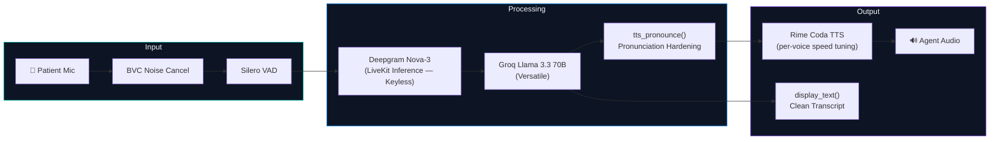
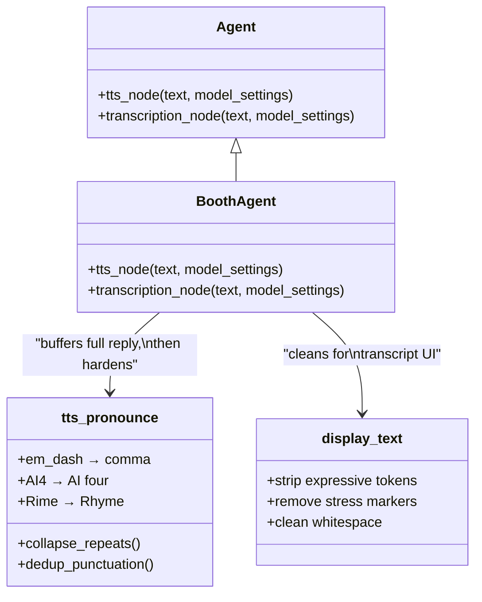
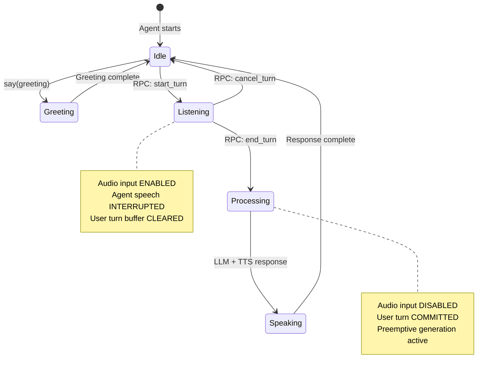

<p align="center">
  
  
  
  
  
</p>

<h1 align="center">🤖 Voice Agent — Apex Medical Center</h1>
<p align="center"><em>LiveKit-powered real-time voice agent with push-to-talk, pronunciation hardening, and healthcare persona</em></p>

---

## Overview

This is the **Python voice agent** component of the Apex Medical Center booking system. It connects to LiveKit Cloud and processes live patient conversations through a full AI pipeline:

```
🎤 Patient Audio → Deepgram STT → Groq Llama 3.3 LLM → Pronunciation Hardening → Rime Coda TTS → 🔊 Agent Audio
```

The agent embodies **"Sarah"**, a warm, HIPAA-mindful Care Coordinator who can book appointments, check doctor availability, quote consultation fees, and verify insurance.

---

## 🛠️ AI Pipeline Stack



| Layer | Technology | Notes |
|:------|:-----------|:------|
| **STT** | Deepgram Nova-3 via LiveKit Inference | Keyless — uses LiveKit Cloud credentials only |
| **LLM** | Groq Llama 3.3 70B Versatile | Fast inference via OpenAI-compatible Groq plugin |
| **TTS** | Rime Coda | Per-voice `time_scale_factor` for speed tuning |
| **VAD** | Silero VAD | Voice activity detection for turn boundaries |
| **Noise** | LiveKit BVC | Background voice cancellation |
| **Turn** | Manual (Push-to-Talk) | RPC-driven: `start_turn`, `end_turn`, `cancel_turn` |

---

## 📁 File Structure

```
agent/
├── 📄 agent.py          ← Entrypoint: BoothAgent class, RPC handlers, session lifecycle
├── 📄 personas.py       ← Sarah persona, clinic details, voice config, system prompt builder
├── 📄 pronounce.py      ← tts_pronounce() & display_text() — pronunciation hardening
├── 📄 pyproject.toml    ← Python dependencies (uv/pip compatible)
├── 📄 uv.lock           ← Lockfile for reproducible builds
├── 📄 Dockerfile        ← Multi-stage production container (Python 3.13 + uv)
├── 📄 livekit.toml      ← LiveKit agent metadata
├── 📄 .env.example      ← Environment variable template
└── 📄 README.md         ← You are here
```

---

## 🚀 Quick Start

### Prerequisites

- **Python 3.10+**
- **uv** package manager: `pip install uv`
- **LiveKit Cloud** account with API credentials
- **Groq** API key (for Llama 3.3)
- **Rime** API key (for Coda TTS)

### Setup & Run

```bash
# Install dependencies
uv sync

# Configure environment
cp .env.example .env
# Fill in all keys (see table below)

# Run in development mode
uv run agent.py dev
```

### Environment Variables

| Variable | Required | Description |
|:---------|:---------|:------------|
| `LIVEKIT_URL` | ✅ | `wss://your-project.livekit.cloud` |
| `LIVEKIT_API_KEY` | ✅ | LiveKit project API key |
| `LIVEKIT_API_SECRET` | ✅ | LiveKit project API secret |
| `ANTHROPIC_API_KEY` | ✅ | Anthropic key (legacy — currently uses Groq) |
| `RIME_API_KEY` | ✅ | Rime API key for Coda TTS |

> 💡 **STT is keyless** — Deepgram Nova-3 runs through LiveKit Inference using your LiveKit Cloud credentials. No Deepgram API key needed.

---

## 🧠 Agent Architecture

### BoothAgent Class

The `BoothAgent` extends the base LiveKit `Agent` with two custom nodes:



### Push-to-Talk RPC Flow

The agent operates in **strict half-duplex** mode — mic and agent audio never overlap:



---

## 🩺 Persona Configuration

Defined in `personas.py`:

| Field | Value |
|:------|:------|
| **Character** | Sarah — Care Coordinator |
| **Company** | Apex Medical Center |
| **Voice** | Arcade (Rime Coda) |
| **Speed** | 1.0x (default) |
| **Greeting** | "Hello! Thank you for calling Apex Medical Center, this is Sarah..." |

### Voice Rules (TTS Guidelines)

- Clear, reassuring, empathetic English
- Concise replies (1-3 sentences)
- All numbers spelled as words
- Natural contractions
- Emergency → direct to 911

---

## 🚢 Deployment

### LiveKit Cloud Agents

```bash
# First time
lk agent create --region us-east --secrets-file .env

# Updates
lk agent deploy
```

### Docker (Self-hosted)

```bash
docker build -t apex-voice-agent .
docker run --env-file .env apex-voice-agent
```

The Dockerfile uses a **multi-stage build**:
1. **Build stage**: Compiles native extensions with gcc/g++, installs deps via `uv sync --locked`, pre-downloads ML models
2. **Production stage**: Minimal runtime image, non-root user, bytecode-compiled Python

---

## 🔧 Extending

### Adding a New Specialty/Doctor

Edit `personas.py` → `CLINIC_PERSONA` string to add doctor details, then the frontend persona cards will match.

### Adjusting Voice Speed

Edit `VOICE_SPEED` dict in `personas.py`:

```python
VOICE_SPEED = {
    "arcade": 1.0,    # Default speed
    "luna": 1.1,      # 10% slower (more deliberate)
    "vespera": 1.05,  # 5% slower
}
```

### Adding Pronunciation Rules

Add regex patterns to `pronounce.py` → `tts_pronounce()` function. Run transforms **before** any other text processing.

---

<p align="center">
  <sub>Part of the <a href="../README.md">Apex Medical Center Voice AI</a> system</sub>
</p>
